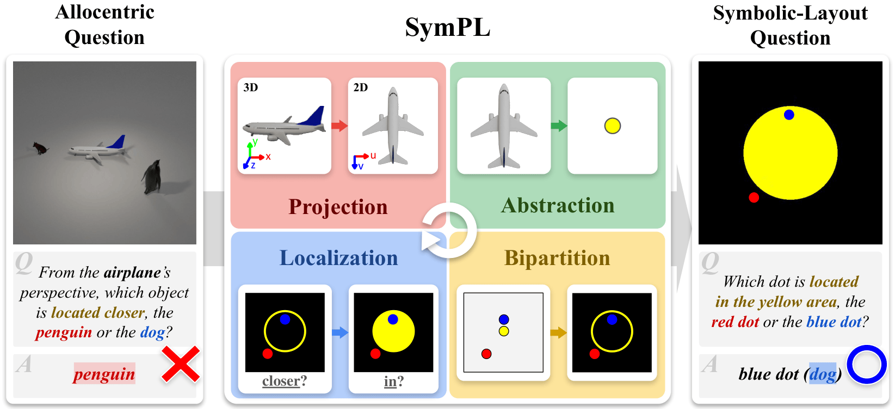
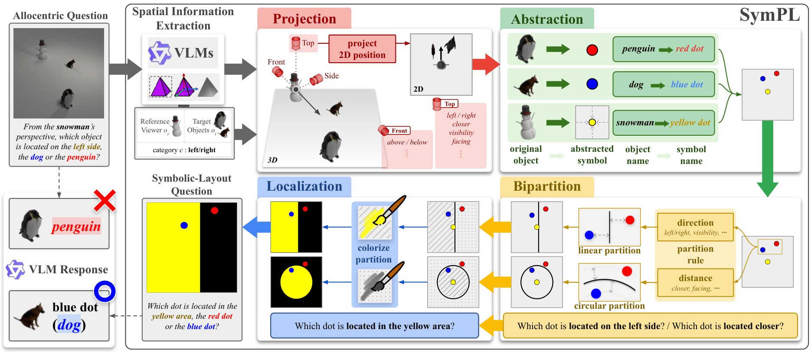
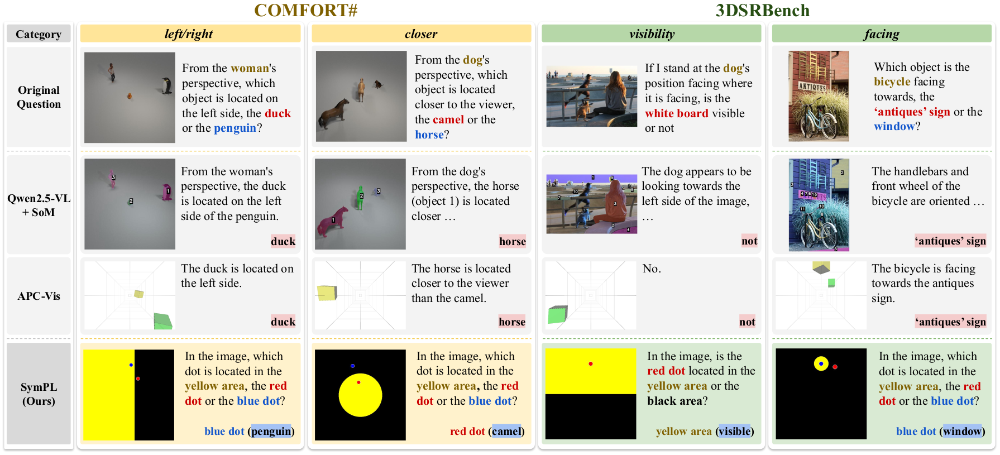

# Keep it SymPL: Symbolic Projective Layout for Allocentric Spatial Reasoning in Vision-Language Models

The official implementation of "Keep it SymPL: Symbolic Projective Layout for Allocentric Spatial Reasoning in Vision-Language Models" (CVPR 2026).

<p align="center">
  <a href="https://sites.google.com/khu.ac.kr/jjy-fine/home" target="_blank"><strong>Jaeyun Jang</strong></a> ·
  <a href="https://seunghui-shin.github.io/" target="_blank"><strong>Seunghui Shin</strong></a> ·
  <a href="https://airlab.khu.ac.kr/" target="_blank"><strong>Taeho Park</strong></a> ·
  <a href="https://sites.google.com/view/hyoseok-hwang" target="_blank"><strong>Hyoseok Hwang</strong></a><sup>*</sup> 
</p>

<p align="center">
  <a href="https://arxiv.org/abs/2602.19117">
    
  </a>
  <a href="https://airlabkhu.github.io/SymPL/">
    
  </a>
</p>

## Abstract
<p align="justify">
Perspective-aware spatial reasoning involves understanding spatial relationships from specific viewpoints—either egocentric (observer-centered) or allocentric (object-centered). While vision–language models (VLMs) perform well in egocentric settings, their performance deteriorates when reasoning from allocentric viewpoints, where spatial relations must be  nferred from the perspective of objects within the scene. In this study, we address this underexplored challenge by introducing <strong>Symbolic Projective Layout (SymPL)</strong>, a framework that reformulates allocentric reasoning into symbolic-layout forms that VLMs inherently handle well. By leveraging four key factors—projection, abstraction, bipartition, and localization—SymPL converts allocentric questions into structured symbolic-layout representations. Extensive experiments demonstrate that this reformulation substantially improves performance in both allocentric and egocentric tasks, enhances robustness under visual illusions and multi-view scenarios, and that each component contributes critically to these gains. These results show that SymPL provides an effective and principled approach for addressing complex perspective-aware spatial reasoning.
</p>



Figure 1. SymPL reformulates allocentric questions into symbolic layout questions using four factors-projection, abstraction, bipartition, and localization-enabling significantly improved spatial reasoning under allocentric settings.
## 🧠 Main Framework


Figure 2. Overview of SymPL framework. SymPL reformulates an allocentric question into a symbolic-layout question through two stages: 1) Spatial Information Extraction and 2) Question Reformulation using four key factors — projection, abstraction, bipartition, and localization.
## 📊 Main Results


Table 1. Quantitative results on allocentric questions. Bold indicates the best, while underline represents the second best results.


Figure 3. Allocentric spatial reasoning examples. Qwen2.5-VL + SoM and APC-Vis exhibited limited allocentric spatial reasoning performance across various categories. In contrast, our SymPL effectively handled allocentric questions by reformulating them into symbolic layout questions.
## 📦 Installation

#### Enviroments:

- Python 3.10
- Pytorch 2.4.1
- Torchvision 0.19.1
- Torchaudio 2.4.1
#### Install vision modules and requirements
```
# install vision module dependencies & download checkpoints
bash setup/setup_vision_modules.sh

# install other dependencies
pip install -r setup/requirements.txt
```

## 🚀 Getting started
You can run the project using run_simple.py.
Within this file, you can modify the input image, prompt and save path as needed.
```
python run_sympl.py
```
## Citation

You can cite our work by BiBTex.

```bibtex
@inproceedings{jang2026sympl,
  title={Keep it SymPL: Symbolic Projective Layout for Allocentric Spatial Reasoning in Vision-Language Models},
  author={Jaeyun, Jang and Seunghui, Shin and Taeho, Park and Hyoseok, Hwang},
  year={2026},
  url={https://arxiv.org/abs/2602.19117}
}
```
## Acknowledgement
This project is partially derived from Perspective-Aware Reasoning in Vision-Language Models via Mental Imagery Simulation [[ICCV 2025]](https://github.com/KAIST-Visual-AI-Group/APC-VLM.git) (Apache License 2.0).
